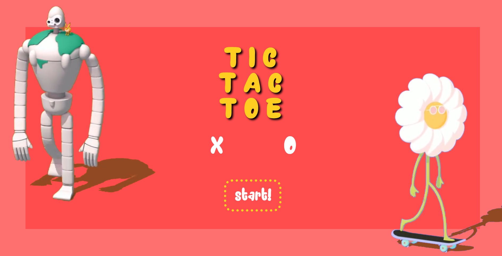

# Tic Tac Toe Game

This is a simple web-based Tic Tac Toe game implemented using HTML, CSS, and JavaScript. It allows two players to take turns and play the classic game of Tic Tac Toe. Additionally, there is an option to play against an AI opponent.

# Preview

## Game Controls

- **Player 1 (X)**: Click on the "X" box to enter your name.
- **Player 2 (O)**: Click on the "O" box to enter your name or play against the AI.

## What I Learned

While working on this project, I gained valuable experience in web development and JavaScript. Here are some key takeaways:

1. **HTML and CSS**: I improved my HTML and CSS skills by designing a visually appealing user interface for the game. I used CSS animations and transitions to create smooth and engaging user interactions.

2. **JavaScript**: I deepened my understanding of JavaScript, particularly in the context of web development. I used JavaScript to handle game logic, player interactions, and AI moves using the minimax algorithm. This project allowed me to practice event handling, DOM manipulation, and asynchronous programming.

3. **Game Logic**: I learned how to implement the logic for a classic game like Tic Tac Toe. This involved checking for win conditions, detecting ties, and managing the flow of the game.

4. **AI Programming**: Creating an AI opponent was a challenging but rewarding aspect of the project. I delved into the minimax algorithm to make the AI make strategic decisions and compete against human players.

5. **User Experience**: I gained insights into designing a user-friendly interface and improving the overall user experience. This includes handling player input, providing feedback through messages, and ensuring smooth transitions between game states.

6. **Project Organization**: I practiced organizing my code into modules and using the module pattern to encapsulate functionality. This made the code more maintainable and easier to understand.

7. **Problem Solving**: I encountered various challenges throughout the project and developed problem-solving skills to overcome them. Debugging and testing became integral parts of the development process.

8. **Version Control**: I used version control tools (e.g., Git) to manage the project's codebase, track changes, and collaborate with others if needed.

## Technologies Used

- HTML
- CSS
- JavaScript

## Acknowledgments

- Assets from [miguelgarest](https://dribbble.com/miguelgarest)

Enjoy playing Tic Tac Toe!
